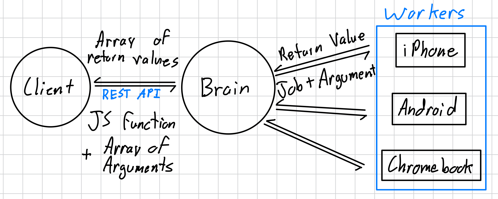

# E-Waste Beowulf Cluster

A tool that makes it easy to repurpose old low power internet connected devices by running arbitrary compute tasks across several devices, giving them a new life and keeping them out of landfills by harnessing there compute.

Many people have created Beowulf clusters before, however almost all of them require either root access to the device or a full custom operating system install, this allows for very high performance compute but it really limits what devices the cluster can run on. In comparison, our cluster does not require root access and instead executes tasks using javascript in a browser, this allows our cluster to run on just about any device without needing root access.

## Architecture

The architecture consists of a central server that receives tasks from the client and distributes them to light edge nodes. The whole system can run over the internet or on a local network if security is needed.

All tasks are written in javascript and can therefore be executed on any devices with a javascript enabled web browser.

## Example Video
